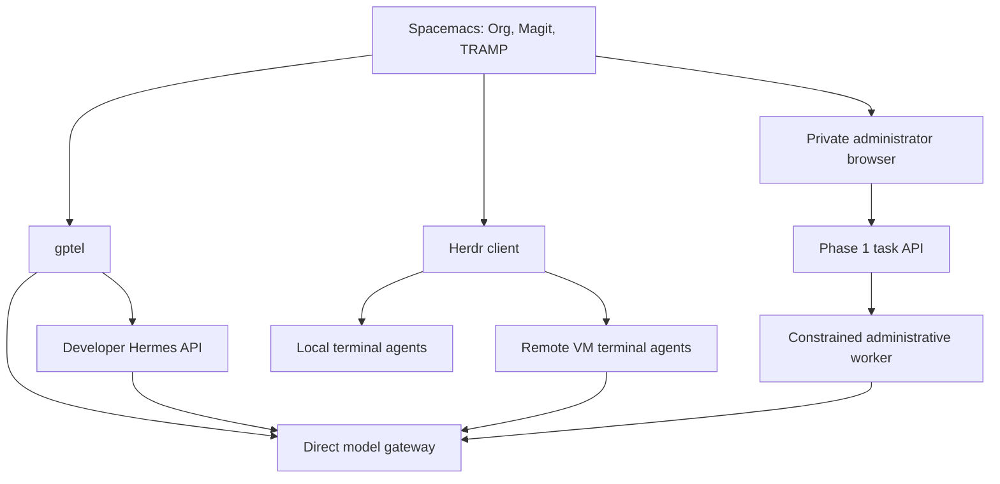

# Spacemacs as an Agentic Development Environment

## Direct answer

Yes, gptel can be a client of a remote developer Hermes API. A job broker can be
added behind an orchestrator when multiple executors need durable dispatch. But
**Herdr and Herder are different projects**, and neither is required between every
gptel request and Hermes. Running Herdr on your workstation is useful. Moving all
of it off the workstation was an overly broad earlier recommendation.

An ADE here means that your editor can read and edit code, maintain research notes,
inspect versioned changes, converse with models, delegate bounded work and review
its evidence. The GPUs need not be attached to the editor. Neither terminal
multiplexing nor a chat interface alone provides the full system.

## Distinct responsibilities

| Component | Project | Responsibility in your environment |
| --- | --- | --- |
| gptel | `karthink/gptel` | Emacs buffers, context selection, chat, direct model calls; optional local tool loop |
| Hermes | `NousResearch/hermes-agent` | Agent loop, tools, profiles, sessions and memory behind a permitted interface |
| Herdr | `herdrdev/herdr` | Persistent terminal server/client, agent panes, local and SSH-connected machines |
| Herder | `cleonhp88/herder` | Optional local CLI-job supervisor with queue, routing, retries and provider cooldown |
| Glyph | `fru-dev3/glyph` | zsh wrappers for session naming and fleet/pane launch conveniences |
| Agent Control Plane | `nyameko/agent-control-plane` | Authenticated task contracts, policy, durable status, audit and later delegation |
| Kubernetes / Slurm / OpenStack | Existing infrastructure | Service/workload scheduling and actual resource authority |
| vLLM / Ollama / llama.cpp | Model serving | Run selected model weights and expose inference |

This review assumes the **Glyph project by fru-dev3**, which explicitly integrates
with Herdr, rather than an unrelated project with the same name. The repositories
were inspected at the source revisions in `14-integration-review.md`.

## Three everyday paths

**Quick reasoning/editing:** select code in a buffer and ask a direct inference
endpoint to explain it. That can be your local ROCm Ollama, an A100 service or an
H200 model gateway. A larger model can run remotely while Emacs remains local.
A chat request alone does not clone repositories or execute tests.

**Developer delegation:** gptel talks to an independently operated developer
Hermes endpoint. Hermes can inspect an authorized worktree and use a configured
sandbox. The editor retains the patch-review experience through Magit and TRAMP.
Do not connect this developer service to the production admin-readonly profile's
volume or credentials. Phase 1's worker is not a general chat API.

**Supervise terminal agents:** open Herdr in vterm or a standalone terminal. Keep
small interactive agents local; attach to agents on an always-on OpenStack VM for
long tasks. These agents can all use the remote model gateway. GPU inference on
H200 does not imply that the terminal process or checkout must reside on H200.

The `.spacemacs.d` patch supplies `my-gptel-chat-hermes`, `my-gptel-chat-model`,
`my-gptel-herdr` and `my-gptel-open-admin`. It fixes package ownership by extending
the already enabled `llm-client` layer through `post-init-gptel`. Credentials come
from auth-source; the Hermes API alias is `hermes-agent`, not a provider model ID.
Local gptel tools start disabled in these buffers, so a remote Hermes conversation
does not accidentally become a second privileged tool loop on your workstation.

## Why local Herdr is useful

Herdr's background server owns terminal processes. Closing its UI or losing an
SSH connection can leave those processes running on the server's host. A laptop
suspending or a host rebooting is different: original processes do not survive.
Herdr can restore layout and resume supported agent sessions after a server
restart, which is not the same as preserving a running compiler or arbitrary job.

A good arrangement for blackmyth is a local Herdr client/server for interactive
work, plus saved remote machines backed by an always-on 32- or 64-vCPU VM. Heavy
inference remains on A100/H200. SSH, filesystem permissions and the remote process
owner determine access. Herdr pane labels and its local socket are not a
multi-tenant authorization boundary. Avoid sharing an administrative Unix account
or exposing its socket to researcher workloads.

Herdr's official Hermes integration is installed with
`herdr integration install hermes` in the chosen developer `HERMES_HOME`, followed
by restarting Hermes. It provides native session identity for restore. At the
reviewed revision, Hermes working/blocked/idle detection still uses terminal
screen manifests; it does **not** become authoritative semantic task completion.
Record native Hermes session IDs, Herdr pane/machine references and ACP run UUIDs
as separate correlated fields in a later adapter. A screen showing "done" must
not settle an infrastructure approval or a scientific experiment's provenance.

References: [Herdr repository](https://github.com/herdrdev/herdr),
[official integration semantics](https://herdr.dev/docs/integrations/),
[Herdr documentation](https://herdr.dev/docs/).

## What Glyph changes

Glyph wraps existing agent commands in zsh. It builds human-readable names from
label, project, agent, machine and time; it can rename Herdr panes and launch
preset fleets, including remote hosts. This is directly relevant to your zsh/Zim
workstation when several similar-looking agent sessions are open. It does not
replace gptel, create an agent reasoning loop, enforce tenant policy or schedule
GPUs. Treat its marks as display labels; retain UUIDs for durable identities.

There are practical caveats in the reviewed code:

- A single bare positional word is interpreted as a label; a phrase with spaces
  is treated as a prompt. This changes the meaning of some existing CLI usage.
- The wrappers can append agent-specific flags, including Claude remote-control
  behavior. Review the wrapper for each agent you actually use before sourcing it.
- Leave `GLYPH_YOLO` **unset** for your normal workflow. The implementation tests
  whether it is nonempty, so `GLYPH_YOLO=0` also enables the approval-bypass flag.
  This is a code finding, more precise than the README's `=1` shorthand.
- `glyph update` retrieves and sources code. Prefer a reviewed, pinned checkout
  and deliberate updates, especially when the shell has infrastructure access.
- A fleet launches agent sessions; it does not establish a DAG, cross-repository
  transaction, approval policy or guaranteed isolated checkout for every agent.
  Give concurrent coding agents separate branches/worktrees and integration tests.

Glyph is optional developer ergonomics. Do not install its wrappers or automatic
fleet startup into the production Phase 1 administrative worker.

Reference: [Glyph source and README](https://github.com/fru-dev3/glyph).

## Where a dedicated Herder service would fit

The separate **Herder** project describes a local job supervisor for AI CLI
workers. Its SQLite queue, roles, provider fallback, cooldown and per-host
concurrency can be useful for a personal agent workstation or dedicated worker
VM. It is reasonable to evaluate it locally first. Its actual source and platform
support should determine deployment; do not treat macOS sandbox mechanisms as
protection for an Arch Linux worker.

In a later controlled integration, ACP would authorize a task and submit a bounded
job envelope to a Herder adapter. The adapter would return durable job references
and normalize status/events into ACP. Herder would supervise its worker processes;
Kubernetes/Slurm would still allocate compute. A crash between acceptance and job
creation requires idempotency/reconciliation, not another nested orchestrator
retrying blindly. Credentials, cancellation, timeouts and result checksums must
be part of the adapter contract.

Phase 1 already has the small durable queue it needs in PostgreSQL. Adding Herder
now would add a second queue without an executor fleet to justify it. Do not make
Herdr, Herder, Hermes and ACP four equally authoritative schedulers. Use one owner
for each task's lifecycle and correlate subordinate job/session identities.

Reference: [Herder](https://github.com/cleonhp88/herder).

## Adoption sequence

1. Use the corrected gptel layer and save Org chat buffers. Keep local Herdr for
   interactive work; review Glyph independently before sourcing wrappers.
2. Operate a separate developer Hermes profile on an always-on VM, using existing
   SSH/WireGuard access and a permitted inference endpoint. Do not expose its
   gateway publicly merely to make Emacs connectivity easier.
3. Use the Phase 1 private administrator page for observed infrastructure state.
4. Add isolated repository worktrees/sandboxes and a typed job adapter. Evaluate
   whether Herder helps at that point; it is optional, not a foundational dependency.
5. Add controlled multi-repository changes: one branch per repo, a coordination
   record, CI evidence, review, and ordered promotion through infrastructure/portal/
   workflow contracts. Follow with evaluated model-routing policies.

Saving a gptel buffer is not enough to share a canonical server-side conversation
with the portal or JupyterLab. Hermes exposes session headers and richer run APIs,
but the bridge still needs authenticated conversation binding, streaming events,
approvals, cancellation and history synchronization. The Phase 1 API does not
claim to implement `/v1/chat/completions` for arbitrary clients.

References: [gptel](https://github.com/karthink/gptel),
[Hermes programmatic interfaces](https://hermes-agent.nousresearch.com/docs/developer-guide/programmatic-integration).
